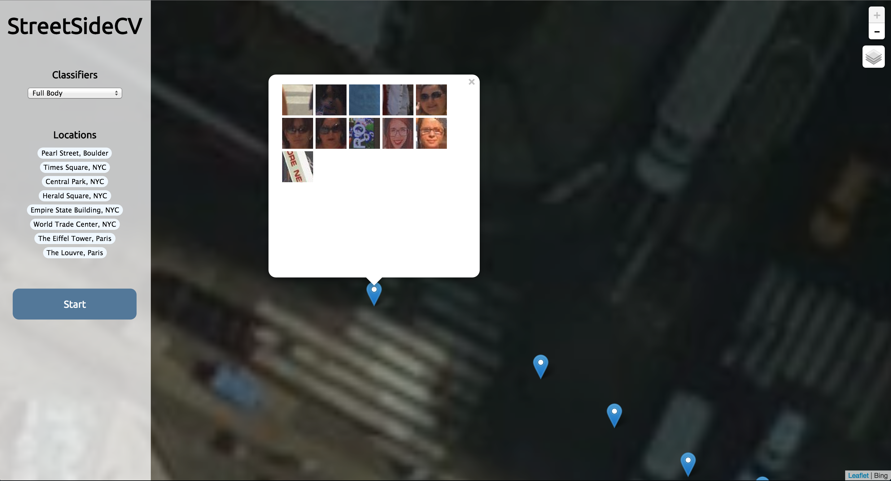

StreetSideCV
============

StreetSideCV is a web application for running object detections on Bing's
[StreetSide](http://www.microsoft.com/maps/streetside.aspx) imagery, using
[OpenCV](http://opencv.org/). The project is powered by
[node.js](https://nodejs.org/), and uses a [mysql](https://www.mysql.com/)
database backend to save detections.

Installation
------------
- Install opencv
  - Install it via your chosen package manager, if it's available
  - Hint for windows: check out (chocolatey)[https://chocolatey.org/]
  - Otherwise, you can find OpenCV's install instructions [here](http://docs.opencv.org/doc/tutorials/introduction/linux_install/linux_install.html).
- Install [node.js](https://nodejs.org/)
- Install mysql
- `npm install` - installs dependencies
- Copy contents of schema.sql into mysql terminal to setup database

Usage
-----
- `node app.js` - starts the application (may require sudo, if there's port conflicts)
- go to http://localhost:4000
- Select a box where you'd like to find detections
  - Location links are available to zoom to specific locations
- Hit start, and see detections pop up on the map!

